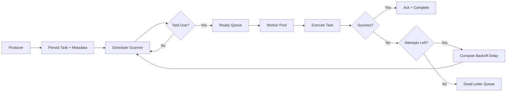

# Distributed Task Scheduler

A fault-tolerant distributed scheduling system for delayed jobs, retries, and parallel background processing across multiple worker nodes.

---

## Problem It Solves

Background work such as notifications, payment retries, and asynchronous workflows must survive instance restarts and transient failures. This scheduler coordinates task timing, retry policy, and worker execution while preserving delivery guarantees in distributed environments.

## Key Features

- Scheduled and delayed task execution
- Retry policy with exponential backoff
- Dead Letter Queue (DLQ) for terminal failures
- Distributed workers for parallel processing
- Task lifecycle state tracking
- Redis/Kafka-backed persistence options

## Architecture



## How it works (high level)

- Producers submit tasks with schedule and retry metadata.
- Scheduler moves due tasks into a ready queue for execution.
- Workers consume and execute tasks in parallel.
- Successful execution is acknowledged and finalized.
- Failures are retried with backoff or routed to DLQ after max attempts.

## How It Works (Detailed)

### Scheduling and Dispatch

- Tasks are stored with due timestamp and retry metadata
- Scheduler continuously scans due tasks
- Due tasks are atomically moved to ready queue for workers

### Retry and Backoff

- Failure increments attempt counter
- Next run is computed via exponential backoff rule
- Max-attempt breach routes task to DLQ

### Task Lifecycle

- `PENDING -> SCHEDULED -> RUNNING -> SUCCEEDED`
- Failure path: `RUNNING -> RETRY_WAIT -> RUNNING`
- Terminal failure path: `RUNNING -> DEAD_LETTERED`

## Performance / Benchmarks

Expected baseline behavior in local or staging environments:

- Dispatch latency depends on scheduler poll interval and queue depth
- Throughput scales with worker concurrency and task duration profile
- Retry bursts can be smoothed via jitter and bounded backoff windows

Meaningful benchmarks should separate CPU-bound and I/O-bound workloads and report queue depth, success ratio, and p95 completion time.

## Example Use Cases

- Email and notification delivery
- Payment retry workflows
- Webhook fan-out and retry
- General asynchronous background processing

## Trade-offs and Design Decisions

- At-least-once delivery is favored over exactly-once complexity
- Distributed coordination improves resilience but increases operational moving parts
- DLQ improves safety and observability at the cost of reprocessing workflows

## Next Improvements

- Add idempotency key support for safer retries
- Add shard-aware scheduling for very large queue volumes
- Add per-tenant quotas and fairness controls
- Add operational dashboard for retry storms and DLQ trends

## Benchmark Methodology

For scheduler performance validation, benchmark with:

- Separate CPU-bound and I/O-bound task profiles
- Fixed retry policy and bounded concurrency levels
- Queue depth, completion latency, and success-rate metrics
- Dedicated reporting for DLQ rate and retry amplification

## Implemented First PR: Distributed Dispatch Rate Limiter

This repository now includes a Redis-backed distributed rate limiter for worker dispatch coordination.

### Package Structure

- `com.diacenco.scheduler.dispatch.api` - HTTP API for requesting dispatch permits
- `com.diacenco.scheduler.dispatch.application` - application service for dispatch decisions
- `com.diacenco.scheduler.ratelimit.domain` - rate limiter abstractions and permit model
- `com.diacenco.scheduler.ratelimit.infrastructure` - Redis + Lua atomic limiter implementation
- `com.diacenco.scheduler.ratelimit.config` - strongly typed rate limiter configuration

### Default Configuration

```yaml
scheduler:
  dispatch:
    rate-limit:
      limit: 10
      window-seconds: 1
      key-prefix: dts:ratelimit:dispatch
```

### API

- `POST /api/v1/dispatch/permit`
    - `200 OK` - permit granted
    - `429 TOO_MANY_REQUESTS` - rate limit exceeded
