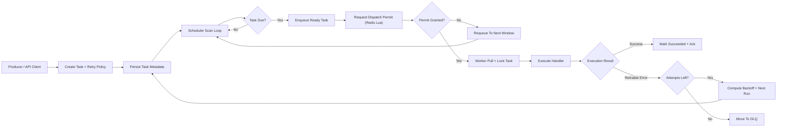

# Distributed Task Scheduler

A production-oriented distributed scheduler for delayed jobs, retries, and resilient background execution across multiple worker nodes.

---

## Problem It Solves

Business-critical background flows (notifications, payment retries, webhooks) must remain reliable during restarts, node failures, and traffic spikes. This application coordinates scheduling, dispatch throttling, retries, and dead-letter handling to keep processing predictable under distributed load.

## Key Features

- Scheduled and delayed task execution
- Distributed worker pool with controlled parallelism
- Redis-backed dispatch rate limiter for fair worker coordination
- Retry policy with exponential backoff for transient failures
- Dead Letter Queue (DLQ) for terminal failures and safe triage
- Explicit task lifecycle tracking and operational visibility

## Architecture



## How It Works

- Producers submit tasks with execution time, retry policy, and payload metadata.
- A scheduler loop continuously selects due tasks and prepares them for dispatch.
- Before dispatching, workers request a distributed permit to avoid rate bursts.
- Workers execute tasks with at-least-once semantics and explicit state transitions.
- Retriable failures are rescheduled with backoff; exhausted tasks are moved to DLQ.

## Example Use Cases

- Email and notification delivery
- Payment retry workflows
- Webhook fan-out and retry
- General asynchronous background processing

## Dispatch Permit API

- `POST /api/v1/dispatch/permit`
    - `200 OK` when permit is granted
    - `429 TOO_MANY_REQUESTS` when rate limit is exceeded

## Configuration

```yaml
scheduler:
  dispatch:
    rate-limit:
      limit: 10
      window-seconds: 1
      key-prefix: dts:ratelimit:dispatch
```

## Trade-offs and Design Decisions

- At-least-once delivery is favored over exactly-once complexity in distributed systems.
- Redis-based coordination improves resilience and throughput, with additional operational complexity.
- DLQ-first failure isolation improves safety and diagnostics, requiring explicit reprocessing workflows.

## Next Improvements

- Add idempotency key support for safer retries
- Add shard-aware scheduling for very large queue volumes
- Add per-tenant quotas and fairness controls
- Add operational dashboard for retry storms and DLQ trends
